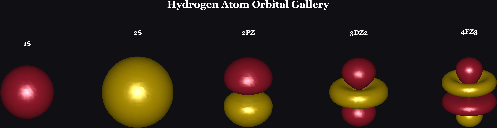
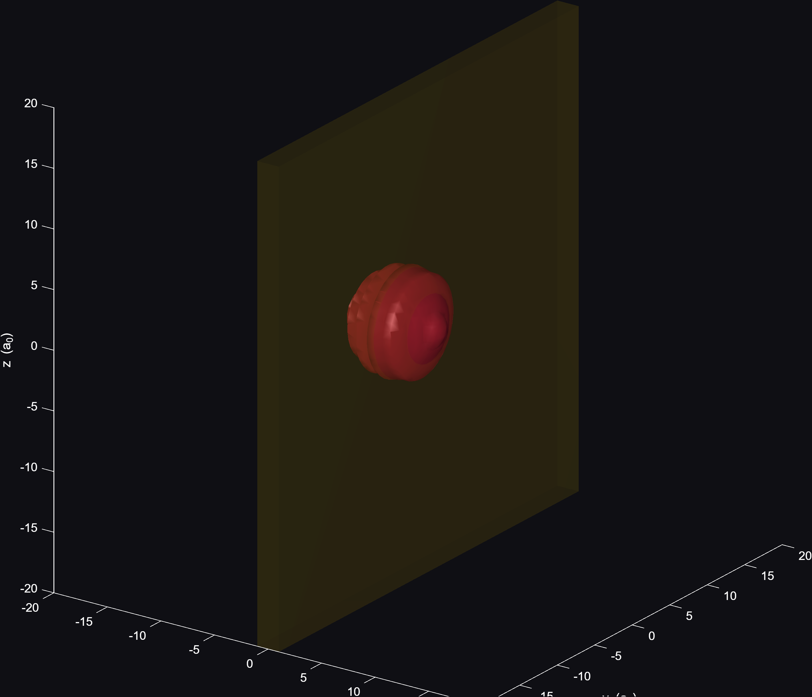

# Quantum Tunneling & Atomic Orbitals — A 3D Julia/MATLAB Simulation


A from-scratch numerical solution of the 3D time-dependent Schrödinger
equation (quantum tunneling through a potential barrier) and the exact
analytical hydrogen-atom orbitals, verified against closed-form physics
and rendered as publication-quality 3D visuals.

## Mathematical Derivation: The Hydrogen Atom

The time-independent Schrödinger equation for an electron in a Coulomb
potential is

$$-\frac{\hbar^2}{2m}\nabla^2\psi + V(r)\psi = E\psi, \qquad V(r) = -\frac{e^2}{4\pi\varepsilon_0 r}$$

Separating variables, $\psi(r,\theta,\phi) = R(r)\,Y_{lm}(\theta,\phi)$, the
angular part is solved exactly by the spherical harmonics $Y_{lm}$, with
eigenvalue $l(l+1)\hbar^2$ for the angular momentum operator. Substituting
back leaves the **radial equation**:

$$-\frac{\hbar^2}{2m}\frac{1}{r^2}\frac{d}{dr}\left(r^2\frac{dR}{dr}\right) + \left[\frac{\hbar^2 l(l+1)}{2mr^2} - \frac{e^2}{4\pi\varepsilon_0 r}\right]R = ER$$

Substituting $u(r) = rR(r)$ turns this into a 1D-like Schrödinger equation
with an effective potential $V_{\text{eff}}(r) = -\frac{e^2}{4\pi\varepsilon_0 r} + \frac{\hbar^2 l(l+1)}{2mr^2}$.
Requiring $u(r)\to 0$ as $r\to 0$ and $r\to\infty$ (a normalizable,
physical wavefunction) forces the energy to be **quantized**:

$$E_n = -\frac{m e^4}{2(4\pi\varepsilon_0)^2\hbar^2 n^2} = -\frac{13.6\ \text{eV}}{n^2}, \qquad n = 1,2,3,\dots$$

and the radial solutions turn out to be the **associated Laguerre
polynomials**:

$$R_{nl}(r) = \sqrt{\left(\frac{2}{na_0}\right)^3\frac{(n-l-1)!}{2n[(n+l)!]}}\;e^{-r/na_0}\left(\frac{2r}{na_0}\right)^{l} L_{n-l-1}^{2l+1}\!\left(\frac{2r}{na_0}\right)$$

with $a_0$ the Bohr radius. This is exactly what `radial_wavefunction()`
in `hydrogen_orbitals.jl` computes — no lookup table, the Laguerre
recurrence is implemented directly from this formula. A hard consequence
of this solution is that $R_{nl}$ has **exactly $n-l-1$ radial nodes** —
this is the fact `verify_physics.jl` checks numerically against the
theorem above.

<p align="center">
  
</p>
## Mathematical Derivation: Quantum Tunneling Transmission Coefficient

Consider a particle of energy $E$ incident on a rectangular barrier of
height $V_0 > E$ and width $L$. The time-independent Schrödinger equation
$-\frac{\hbar^2}{2m}\psi'' + V(x)\psi = E\psi$ has piecewise solutions:

$$
\psi(x) = \begin{cases}
A e^{ikx} + B e^{-ikx}, & x < 0 \quad \text{(incident + reflected)}\\
C e^{\kappa x} + D e^{-\kappa x}, & 0 \le x \le L \quad \text{(evanescent, inside barrier)}\\
F e^{ikx}, & x > L \quad \text{(transmitted)}
\end{cases}
$$

with $k = \sqrt{2mE}/\hbar$ (oscillatory, classically allowed) and
$\kappa = \sqrt{2m(V_0-E)}/\hbar$ (real and positive since $E<V_0$ —
this is what makes the region **classically forbidden**: classically
$\kappa$ would need to be imaginary, i.e. no real momentum exists there
at all). Requiring $\psi$ and $\psi'$ to be continuous at $x=0$ and
$x=L$ gives four linear equations in $A,B,C,D,F$. Eliminating $B,C,D$
and solving for the transmission probability $T = |F|^2/|A|^2$ yields
the exact closed-form result:

$$T = \left[1 + \frac{V_0^2 \sinh^2(\kappa L)}{4E(V_0-E)}\right]^{-1}$$

The crucial point: **$T > 0$ even though $E < V_0$.** A classical
particle with insufficient energy simply bounces back every time
($T=0$); the quantum particle has a nonzero probability of appearing on
the far side. This is exactly the formula `verify_physics.jl` uses to
sanity-check the numerical 3D simulation below — the simulated and
analytical values should be the same order of magnitude even though the
analytical formula is strictly 1D and the simulation is a full 3D wave
packet with a spread of momenta.

<p align="center">
  
</p>

### Demo: Wave Packet Tunneling Through the Barrier (video)

*(paste your GitHub-hosted video URL here on its own line — see the
Troubleshooting section for the upload method — so it renders as a
playable inline video, not a link)*

*(Screenshots above are generated by this repo's own MATLAB scripts —
see [Quickstart](#quickstart) to reproduce them.)*

## Table of Contents
- [Why this project](#why-this-project)
- [Repo structure](#folder-structure)
- [Quickstart](#quickstart)
- [Physics verification](#step-4--verify-the-physics-not-just-does-it-run)
- [Troubleshooting](#troubleshooting-issues-actually-hit-while-testing-this)
- [License](#license)

## Why this project
Quantum tunneling and atomic orbitals are two of the most iconic results
in physics — instantly recognizable, conceptually deep, and visually
striking. Solving the TDSE from scratch (not just plotting a textbook
formula) demonstrates real numerical methods (FFT-based PDE solving),
while the hydrogen orbitals are derived analytically from the actual
Laguerre/Legendre special functions rather than looked up — good signal
for a research-oriented application.

**Tech stack:**
- **Julia**: numerically solves the 3D time-dependent Schrödinger equation
  (split-operator/FFT method) for a wave packet tunneling through a
  potential barrier, and analytically computes the exact hydrogen-atom
  orbitals (1s, 2s, 2p, 3d, 4f).
- **MATLAB**: renders both as publication-quality 3D isosurfaces, saves
  screenshots, and exports an MP4 animation of the tunneling event.

## Folder structure
```
quantum3d_project/
├── julia/
│   ├── Project.toml
│   ├── tunneling_solver.jl      -> produces tunneling_frames.mat
│   └── hydrogen_orbitals.jl     -> produces orbitals.mat
├── matlab/
│   ├── visualize_tunneling.m    -> reads tunneling_frames.mat, makes PNGs + MP4
│   └── visualize_orbitals.m     -> reads orbitals.mat, makes PNGs + gallery
└── outputs/                     -> created automatically, holds all screenshots/video
```

## Step 1 — Install Julia
Download from https://julialang.org/downloads (free). Then, in a terminal:
```bash
cd quantum3d_project/julia
julia --project=. -e 'using Pkg; Pkg.instantiate()'
```
This installs FFTW.jl and MAT.jl (only needed once).

## Step 2 — Run the physics simulations
```bash
julia --project=. tunneling_solver.jl
julia --project=. hydrogen_orbitals.jl
```
- `tunneling_solver.jl` takes ~1-3 minutes on a laptop (64³ grid, 800 steps).
  It prints the wave packet's mean energy, the barrier height, and the
  final tunneling transmission probability — a real number you can quote
  in your write-up (e.g. "12% transmission despite E < V0").
- `hydrogen_orbitals.jl` takes well under a minute.

Both scripts write `.mat` files directly into the `julia/` folder.

## Step 3 — Run the MATLAB visualizations
Open MATLAB, `cd` into `matlab/`, then:
```matlab
visualize_tunneling.m
visualize_orbitals.m
```
This populates `outputs/` with:
- `tunneling_before_barrier.png`, `tunneling_at_barrier.png`,
  `tunneling_tunneling.png`, `tunneling_after_barrier.png`
- `tunneling_animation.mp4`
- `orbital_1s.png`, `orbital_2s.png`, `orbital_2pz.png`,
  `orbital_3dz2.png`, `orbital_4fz3.png`
- `orbital_gallery.png` (a single poster-style composite — great as a
  standalone image for a portfolio page or application)

No manual screenshotting needed — `exportgraphics` renders these at
300 DPI automatically, so they're print-quality out of the box.

## Tuning knobs worth knowing (for your write-up / if asked about it)
- `tunneling_solver.jl`: `V0` (barrier height), `kx0` (packet momentum,
  sets energy E = kx0²/2), `barrier_half_width` — raising `V0` above `E`
  further shows the "classically forbidden" regime; try a few values and
  plot transmission probability vs. barrier height/width for an extra
  figure (this reproduces the textbook tunneling-coefficient curve).
- `hydrogen_orbitals.jl`: swap in other `(n,l,m)` triples for other
  orbitals (e.g. `(3,1,0)` for 3p, `(3,2,2)` for a cloverleaf 3d_{x²-y²}
  analog) — the code is fully general, not hardcoded to these five.

## Step 4 — Verify the physics (not just "does it run")
Run one more Julia script that checks your results against known,
closed-form analytical physics:
```bash
cd quantum3d_project/julia
julia --project=. verify_physics.jl
```
This checks:
- **Norm conservation** — total probability should stay ≈1.0 at every
  timestep (a unitarity check on the split-operator method itself).
- **Tunneling transmission vs. the exact 1D analytical formula**
  (Griffiths' textbook rectangular-barrier result) — your 3D simulated
  value should be the same order of magnitude.
- **Orbital normalization** — ∫|ψ|² over all space should equal 1 for
  each orbital.
- **Radial node count** — hydrogen orbitals have *exactly* `n - l - 1`
  radial nodes; this is a hard theorem, and the script counts them from
  your actual computed wavefunction and checks against it.

It writes `verification_report.txt` with PASS/FAIL on each check.
**This is the file to screenshot for an application** — "I verified my
simulation against exact analytical results" is a much stronger claim
than "I ran a simulation."

## Troubleshooting (issues actually hit while testing this)
- **`load: Unable to find file`** — the `.mat` files don't exist yet
  because the Julia scripts haven't been run, or MATLAB's current folder
  isn't the `matlab/` directory. Run `pwd` in MATLAB and confirm it ends
  in `...\quantum3d_project\matlab`.
- **Nested duplicate folder after extracting the zip** (e.g.
  `quantum3d_project\quantum3d_project\julia`) — this happens because the
  zip already contains a top-level `quantum3d_project` folder. Not a bug,
  just extract-then-check-the-real-path with `dir /s /b tunneling_solver.jl`
  (Windows) or `find . -name tunneling_solver.jl` (Mac/Linux).
- **Commands silently glue together in terminal** (e.g. `hydrogen_orbitals.jldir`) —
  run one command at a time and wait for it to finish before pasting the next.
- **`VideoWriter(...,'MPEG-4')` errors on Windows/Linux MATLAB** — swap
  `'MPEG-4'` for `'Motion JPEG AVI'` in `visualize_tunneling.m`.
- **`isosurface` produces an empty/blank screenshot** — the isovalue
  threshold (`0.10` or `0.15` fraction of peak) is too high for that
  frame/orbital; lower it in the script.

## Publishing this on GitHub
1. Install Git if you don't have it: https://git-scm.com/downloads
2. Create a new empty repo on github.com (don't add a README there — you
   already have one).
3. From inside `quantum3d_project/` (the folder with this README):
```bash
git init
git add .
git commit -m "Initial commit: 3D quantum tunneling + hydrogen orbital simulation"
git branch -M main
git remote add origin https://github.com/<your-username>/<repo-name>.git
git push -u origin main
```
4. The included `.gitignore` already excludes the large regeneratable
   files (`*.mat` data, `*.mp4` animation) so your repo stays small and
   clean — but keeps the PNG screenshots tracked so they render directly
   in your GitHub README.
5. To actually show the screenshots in your README, add something like
   this near the top of this file (after you've generated the PNGs):
```markdown


```
6. For the animation, since `.mp4` is excluded from the repo: upload it
   as an unlisted YouTube video or to Google Drive, and link it in the
   README instead of committing the file.

## Suggested framing for an application
Lead with the physics question ("does the electron ever go where
classical mechanics forbids?"), show the barrier + wave packet figure,
state the numerical transmission probability from your run, then show
the orbital gallery as the "structure of the atom" payoff. One paragraph
of physics + one number + one striking image tends to land better than
a long code walkthrough.

## License
MIT — see [LICENSE](LICENSE). Free to use, modify, and learn from.
